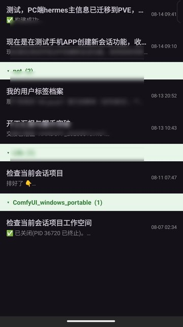
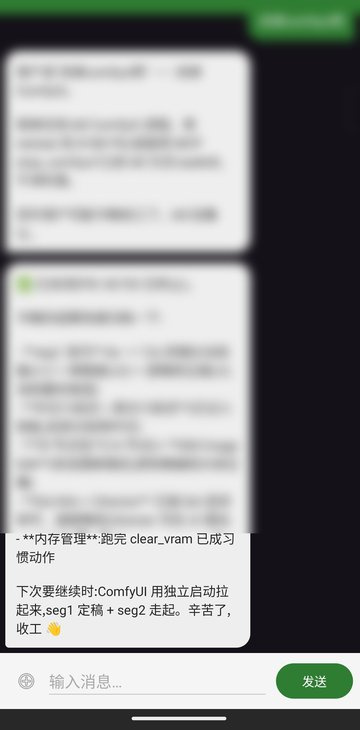

# Hermes Friends (Hermes 好友)

WeChat-style mobile client for [Hermes Agent](https://hermes-agent.nousresearch.com) — turn your Hermes sessions into a "contacts list". Multi-server, project groups, attachments.

微信式的 Hermes Agent 手机客户端 —— 把 Hermes 的会话变成"好友列表",支持多服务器、项目分组、附件收发。

> Built with Hermes Agent, given back to the Hermes community. All intelligence lives on the server; the app is a pure bridge — no AI core bundled.
> 本 App 用 Hermes Agent 开发,回馈 Hermes 社区。核心逻辑完全在服务器端(Hermes),App 只做桥接,不含任何 AI 内核。

## Features / 特性

- 📱 **WeChat-style UX**: sessions as "contacts" — add/delete friends = create/delete sessions / 微信式操作:好友 = 会话窗口
- 🖥 **Multi-server**: one app, multiple Hermes cores; per-server names & isolated credentials / 多服务器:一个 App 连接多个 Hermes 内核,独立账号
- 📂 **Three-level collapsible tree**: server → project group (by workspace) → session / 三层折叠:服务器 → 项目组 → 会话
- 💬 **Full chat**: messages, reasoning display, attachment download & open (APK installs directly) / 收发消息、思考显示、附件下载/打开
- 📷 **Media**: camera / gallery / file upload / 拍照、相册、传文件
- ➕ **Create session with first message** (pick server → group → type) / 输入第一句话即创建新会话
- 🗑 **Long-press** to delete sessions / servers / 长按删除会话/服务器
- 🔒 **No credentials bundled** — server address / username / password are user-provided / 不含任何服务器凭据,地址账号密码用户自填

## Screenshots / 截图

| Session list (multi-server + groups) / 会话列表 | Chat / 聊天 |
|:---:|:---:|
|  |  |

> Screenshots sanitized (real content blurred) / 截图已脱敏处理。

## Prerequisites / 使用前提

A running **Hermes Agent server** (`hermes serve` / dashboard, port 9119):
需要运行中的 **Hermes Agent 服务器**(`hermes serve` / dashboard,端口 9119):

- Docs: https://hermes-agent.nousresearch.com/docs
- Remote access: WireGuard / Tailscale tunnel to your server / 出门在外需隧道访问服务器

## Build / 构建

```bash
# Requires JDK 17 + Android SDK
export ANDROID_HOME=/path/to/android-sdk
./gradlew assembleDebug
# Output: app/build/outputs/apk/debug/app-debug.apk
```

## Usage / 使用

1. Open app → Add server → enter Hermes server address + credentials / 添加服务器
2. Servers collapsed by default; tap to expand / 服务器默认折叠,点击展开
3. Long-press server: rename / delete; long-press session: delete / 长按管理
4. "+" button: add server / new chat in a group / "+" 菜单

## Architecture / 架构

```
App (pure UI, WeChat-style)
   │  HTTPS + WebSocket
   ▼
Hermes serve (your server, port 9119)
   │
   ▼
state.db (single source of truth)
```

Protocol:
- REST: `/api/sessions`, `/api/sessions/{id}/messages`, `/api/files/*`
- WebSocket `/api/ws` (JSON-RPC: session.create / session.resume / prompt.submit / image.attach)

## License

MIT © onlyxn
